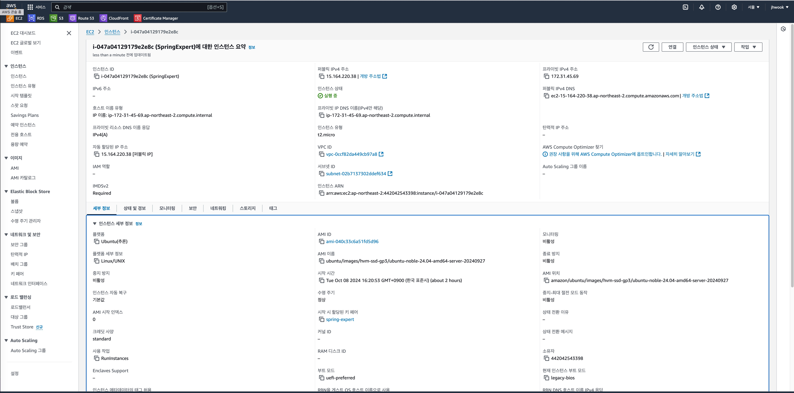

# SPRING PLUS

### 구현한 기능 

1. 인증 및 인가
- Spring Security를 사용하여 인증 및 인가 구현
- JWT를 이용한 토큰 기반 인증 방식

2. 유저 프로필 관리
- 프로필 이미지 업로드 : 사용자가 자신의 프로필 이미지를 S3 버킷에 업로드 및 조회

3. QueryDSL
- DTO Projection을 사용하여 전체 엔티티를 조회하지 않고, 특정 필드만을 추출해 가져오는 방식으로 쿼리 성능을 최적화
- 검색, 페이징 기능 구현

4. AWS

- EC2 인스턴스에 어플리케이션 실행

- 서버 상태 확인할 수 있는 Health Check API
  - **Path**: `http://ec2-15-164-220-38.ap-northeast-2.compute.amazonaws.com:8080/health/check`
  - **Method**: `GET`
  - **ResponseBody**: "Application is running"

- RDS 데이터베이스 생성, EC2에서 실행한 어플리케이션과 연결

## 트러블 슈팅 
https://velog.io/@jhwook/JPA%EC%8B%AC%ED%99%94-AWS-%EA%B3%BC%EC%A0%9C-%ED%8A%B8%EB%9F%AC%EB%B8%94-%EC%8A%88%ED%8C%85

